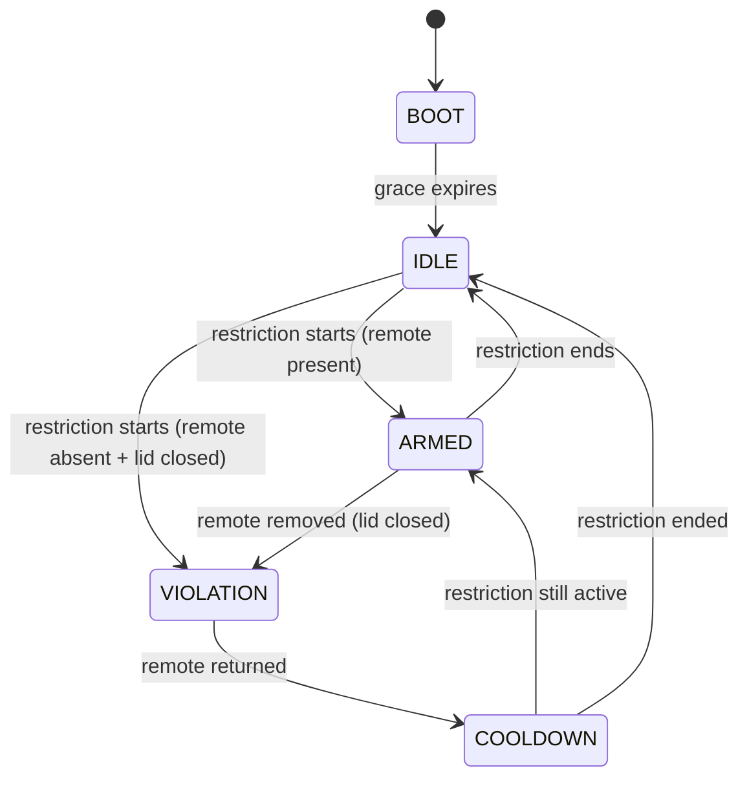

# Latch State Machine, REQ-LOCK-XXX

## State machine overview

## REQ-LOCK-001

**Status:** RED

**Title:** Boot grace period defers all enforcement

**Description:**

After power-on the system spends
LOCK_BOOT_GRACE_S in LOCK_STATE_BOOT during which the motor
holds the lock open and no restrictions are enforced. After
the grace period expires the state machine transitions to
IDLE and normal logic begins.

**Acceptance criteria:**

- t=0 → BOOT, lock_hold_open(true) called
- t < LOCK_BOOT_GRACE_S → stays BOOT regardless of inputs
- t >= LOCK_BOOT_GRACE_S → transitions to IDLE, lock_hold_open(false)
- Schedule and presence inputs are ignored during BOOT

**Tests:**

- test_lock.c::ttest_lock_initial_state_after_init()
- test_lock.c::test_lock_boot_holds_motor_open
- test_lock.c::test_lock_boot_ignores_restricted_window
- test_lock.c::test_lock_boot_does_not_transition_before_grace_period
- test_lock.c::test_lock_boot_transitions_to_idle_after_grace_period

---

## REQ-LOCK-002

**Status:** RED

**Title:** ARMED is a consent-based state, not a physical lock

**Description:**

In ARMED state the motor releases only when
both the lid is closed AND the remote is present. If either is
false, the motor holds the lock open to prevent deadlock. The
lock mechanically engages when the user physically closes the lid.

**Acceptance criteria:**

- ARMED + lid closed + remote present → lock_hold_open(false)
- ARMED + lid open → lock_hold_open(true)
- ARMED + remote absent → lock_hold_open(true)
- Box opening is never automatic — the click incentive is
  eliminated by design

**Tests:**

- test_lock.c::test_lock_armed_lid_closed_remote_present_releases_motor
- test_lock.c::test_lock_armed_lid_open_holds_motor_open
- test_lock.c::test_lock_armed_remote_absent_lid_open_holds_motor_open
- test_lock.c::test_lock_armed_lid_closed_but_not_engaged_holds_open
- test_lock.c::test_lock_armed_fully_engaged_with_remote_releases_motor

---

## REQ-LOCK-003

**Status:** RED

**Title:** Transition to ARMED happens on restriction start

**Description:**

When schedule transitions from MODE_FREE to
a restricted mode, state moves from IDLE to ARMED. Audio and
LED hand-offs happen via display module (outside this scope).
No immediate enforcement — the user must physically close the
lid with the remote inside for the lock to engage.

**Acceptance criteria:**

- IDLE + restricted mode starts → ARMED
- ARMED + restriction ends → IDLE, lock_hold_open(true)
- ARMED + same restriction continues → stays ARMED

**Tests:**

- test_lock.c::test_lock_idle_to_armed_on_restriction_start
- test_lock.c::test_lock_armed_to_idle_when_restriction_ends
- test_lock.c::test_lock_armed_stays_armed_during_restriction

---

## REQ-LOCK-004

**Status:** RED

**Title:** Closed lid without remote triggers escalating audio

**Description:**

If the user closes the lid while the remote
is not inside during a restricted mode, the system plays
escalating audio warnings until they reopen the box. Audio
does not play in MODE_FREE even with this condition.

**Acceptance criteria:**

- ARMED + lid closed + remote absent → play_audio(CLIP_NAG_SOFT)
- Condition persists >30s → play_audio(CLIP_NAG_LOUD)
- Lid reopens → nag audio stops
- MODE_FREE + lid closed + remote absent → no audio

**Tests:**

- test_lock.c::test_lock_armed_lid_closed_remote_absent_plays_nag_soft
- test_lock.c::test_lock_nag_escalates_to_loud_after_30s
- test_lock.c::test_lock_nag_stops_when_lid_opens
- test_lock.c::test_lock_no_nag_in_free_mode

---

## REQ-LOCK-005

**Status:** RED

**Title:** Release button behaviour scales with mode

**Description:**

The release button triggers lock_hold_open
based on the current mode's ReleaseBehaviour. The hold duration
matches schedule_ipad_hold_ms() to keep the friction model
consistent between the remote and iPad decisions.

**Acceptance criteria:**

- MODE_FREE → instant press releases
- MODE_PERMITTED → instant press releases
- MODE_RESTRICTED → hold 20s releases
- MODE_DEEP_FOCUS → hold 60s releases
- MODE_SLEEP → button has no effect
- BOOT state → instant press releases

**Tests:**

- test_lock.c::test_lock_release_button_instant_in_boot
- test_lock.c::test_lock_release_button_instant_in_free_mode
- test_lock.c::test_lock_release_button_restricted_hold_insufficient
- test_lock.c::test_lock_release_button_restricted_hold_sufficient
- test_lock.c::test_lock_release_button_no_effect_in_sleep
- test_lock.c::test_lock_release_button_release_resets_timer

---

# REQ-LOCK-006

**Status:** RED

**Title:** ARMED to VIOLATION when remote is removed

**Description:**

When the remote is removed during ARMED
while the lid is closed, the system transitions to VIOLATION.
ir_send_tv_off() fires once on the transition tick.

**Acceptance criteria:**

- ARMED + lid closed + remote removed → VIOLATION, IR fires once
- VIOLATION + remote still absent → stays VIOLATION, no repeat IR
- Lid open during ARMED is not a violation — it is a neutral state

**Tests:**

- test_lock.c::test_lock_armed_to_violation_on_remote_removed_lid_closed
- test_lock.c::test_lock_violation_no_repeat_ir
- test_lock.c::test_lock_armed_lid_open_remote_absent_no_violation

---

# REQ-LOCK-007

**Status:** RED

**Title:** VIOLATION to COOLDOWN on remote return

**Description:**

When the remote returns during VIOLATION,
the system transitions to COOLDOWN and plays the return
ceremony. IR off signal fires on every remote return in any mode.

**Tests:**

- test_lock.c::test_lock_violation_to_cooldown_on_remote_return
- test_lock.c::test_lock_cooldown_to_armed_if_restriction_active
- test_lock.c::test_lock_cooldown_to_idle_if_restriction_ended
- test_lock.c::test_lock_ir_fires_on_remote_return_in_free_mode
- test_lock.c::test_lock_return_ceremony_plays_audio_once

---

# REQ-LOCK-008

**Status:** RED

**Title:** Violation stage escalates by elapsed time and time remaining

**Description:**

During VIOLATION state, lock_get_violation_stage() returns the current stage based on elapsed time since the violation started and seconds until the restriction window ends. Outside of VIOLATION state it always returns VIOLATION_STAGE_NONE.

**Acceptance criteria:**

- Not in VIOLATION → STAGE_NONE
- VIOLATION + elapsed < 30 min + > 5 min until end → STAGE_NONE
- VIOLATION + elapsed >= 30 min + > 5 min until end → STAGE_SOFT
- VIOLATION + <= 5 min until end → STAGE_WARN
- VIOLATION + window ended → STAGE_LOUD
- Stage is monotonically non-decreasing during a single violation

**Tests:**

- test_lock.c::test_lock_violation_stage_is_none_outside_violation
- test_lock.c::test_lock_violation_stage_is_none_immediately_after_violation_starts
- test_lock.c::test_lock_violation_stage_is_none_before_soft_threshold
- test_lock.c::test_lock_violation_stage_advances_to_soft_at_threshold
- test_lock.c::test_lock_violation_stage_advances_to_warn_when_window_nearly_over
- test_lock.c::test_lock_violation_stage_advances_to_loud_when_window_ends
- test_lock.c::test_lock_violation_stage_is_monotonic_during_single_violation
- test_lock.c::test_lock_violation_stage_resets_on_recovery_to_armed
- test_lock.c::test_lock_violation_stage_resets_on_recovery_to_idle
- test_lock.test_lock_violation_stage_warn_takes_precedence_over_soft

---

# REQ-LOCK-009

**Status:** RED

**Title:** IDLE transitions directly to VIOLATION when restriction
starts with the remote already absent

**Description:** If the schedule transitions from MODE_FREE to a restricted mode while the remote is absent and the lid is closed, the system bypasses ARMED and enters VIOLATION immediately on the transition tick. ir_send_tv_off() fires once. This handles the case where the user left the remote outside the box before a scheduled restriction began.

**Acceptance criteria:**

- IDLE + restricted starts + remote absent + lid closed → VIOLATION
- IDLE + restricted starts + remote absent + lid open → ARMED
  (the lid being open prevents commitment, system waits for closure)
- IR fires exactly once on the IDLE → VIOLATION transition
- BOOT state is unaffected — restrictions are deferred entirely
  during the grace period regardless of remote state

**Tests:**

- test_lockc::test_lock_idle_to_violation_when_restriction_starts_with_remote_absent()
- test_lock.c::test_lock_idle_to_armed_when_restriction_starts_remote_absent_lid_open()
- test_lock.c::test_lock_idle_to_violation_fires_ir_once()
- test_lock.c::test_lock_boot_does_not_violate_with_restriction_and_remote_absent
